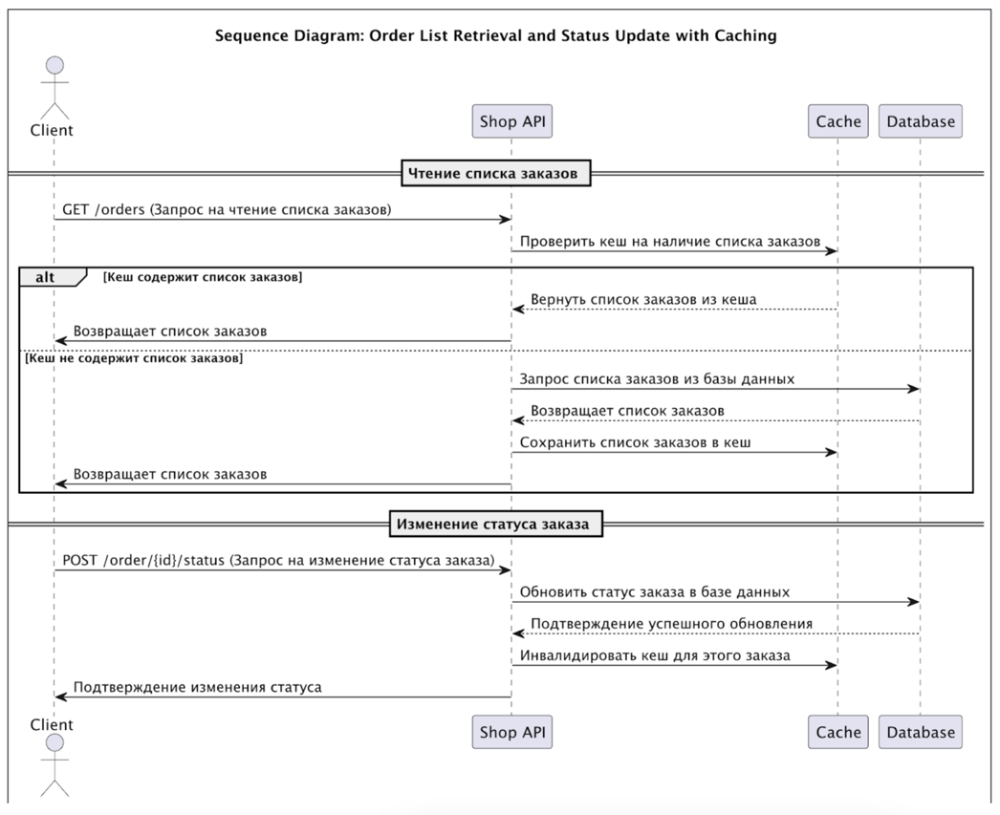

# Кеширование в системе "Александрит"

## 1. Какие части системы имеет смысл закешировать?

На основе анализа системы компании "Александрит" и C4-диаграммы, мы можем выделить несколько частей системы, где кеширование даст наибольшую выгоду:

- **Чтение списка заказов:** операция, которая часто выполняется как клиентами (через Shop API), так и операторами (через CRM и MES API). Поскольку список заказов обновляется не каждую секунду, кеширование позволит снизить нагрузку на базу данных и ускорить время отклика для пользователей.
- **Расчёт стоимости заказа (MES API):** операция сложная и ресурсоёмкая, особенно если клиент загружает детализированную 3D-модель для расчёта. Кеширование результатов расчётов для повторяющихся заказов (или похожих моделей) может существенно снизить нагрузку на систему.

---

## 2. Мотивация

### Проблемы, которые решает кеширование:

- **Высокая нагрузка на базу данных:**  
  Система "Александрит" активно растёт, количество заказов увеличивается каждый месяц. Запросы к базе данных по чтению списка заказов и их статусов увеличивают нагрузку, что может привести к замедлению работы и снижению производительности.

- **Медленное время отклика на операции, которые не требуют моментальных обновлений:**  
  Операции, такие как чтение статусов заказов или расчёт стоимости, выполняются часто, но данные на этих этапах могут редко меняться. Кеширование этих операций ускорит работу системы для клиентов и операторов.

### Какие элементы системы включить в кеширование:

- **Чтение списка заказов (Shop API, CRM API, MES API):**  
  Кеширование позволит уменьшить количество обращений к базе данных и ускорить обработку запросов, связанных с просмотром заказов.

- **Расчёт стоимости заказа (MES API):**  
  Кеширование результатов расчёта для одинаковых или похожих заказов сократит время на повторные вычисления и уменьшит нагрузку на ресурсы.

---

## 3. Предлагаемое решение

### Для данного сценария лучше использовать серверное кеширование по следующим причинам:
- **Контроль и управляемость:** Серверное кеширование позволяет централизованно управлять данными, которые кешируются, что важно при высоком объёме запросов и изменяющихся данных.
- **Снижение нагрузки на серверы и базу данных:** Данные, кешированные на стороне сервера, ускоряют обработку запросов и снижают количество обращений к базе данных.

### Паттерн кеширования: Cache-Aside

Мы выберем паттерн Cache-Aside для серверного кеширования, поскольку он предлагает гибкий и контролируемый механизм работы с кешом:

#### Cache-Aside:

- **Как это работает:** Данные сначала проверяются в кеше. Если они там есть, они возвращаются из кеша. Если нет, данные запрашиваются из базы данных, после чего сохраняются в кеш для будущих запросов.
- **Преимущества:** Позволяет кешировать только те данные, которые часто запрашиваются. Уменьшает нагрузку на базу данных и ускоряет обработку запросов.
- **Недостатки:** Возможны устаревшие данные в кеше, если не настроить правильную стратегию инвалидации.

#### Почему другие паттерны не подходят:
1. **Write-Through:**
    - Автоматически обновляет кеш при каждом изменении данных. Это может быть избыточным для системы, где изменения данных происходят не так часто.
    - Может привести к излишней нагрузке на кеш.
2. **Refresh-Ahead:**
    - Обновляет данные в кеше до того, как они понадобятся. Это нецелесообразно для системы, где запросы могут поступать нерегулярно.

---

## 4. Стратегия инвалидации кеша

Для кеширования в системе "Александрит" мы выберем стратегию инвалидации по ключу и временную инвалидацию (TTL):

1. **Инвалидация по ключу:**
    - При изменении статуса заказа или обновлении списка заказов, кеш для этих данных немедленно **инвалидируется**.
    - Это позволяет поддерживать актуальные данные в кеше и не отдавать клиентам устаревшую информацию.

2. **Временная инвалидация (TTL):**
    - Для часто запрашиваемых данных (например, список заказов или статусы) установим TTL (Time-To-Live) кеша на 5-10 минут.
    - Это позволит обновлять данные через регулярные промежутки времени, даже если изменения в системе происходят редко.

---

### Почему другие стратегии не подходят:
- **Программная инвалидация:** сложна в реализации, так как потребует отслеживания всех операций, которые могут влиять на данные в кеше.
- **Полная инвалидация:** неэффективна, так как приведёт к частой очистке кеша, что лишает систему преимуществ кеширования.

---

## Диаграмма последовательности действий (Sequence diagram)

